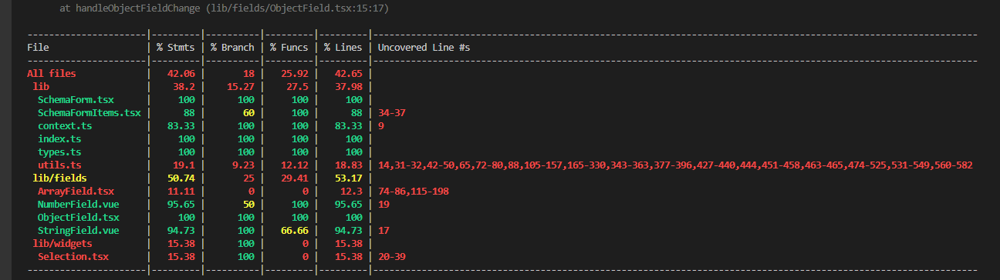

# vue3-cli-ts(vue+ts 打造企业级组件库学习)

## 2

### 2-5

#### h 函数

```js
import { createApp, defineComponent, h } from "vue";
// import App from "./App.vue";
import router from "./router";
import HelloWorld from "./components/HelloWorld.vue";
const App = defineComponent({
  render() {
    return h("div", { id: "app" }, [
      h("img", {
        alt: "Vue logo",
        src: "https://vuejs.org/images/logo.png",
      }),
      h(HelloWorld, { msg: "Hello Vue 3 + TypeScript + Vite", age: 18 }),
    ]);
  },
});
createApp(App).use(router).mount("#app");

/**
 * h(标签名，标签属性，标签内的子标签（多个就是[],文字就是""）)
 */
```

### 2-6\7

#### setup 的运用和其意义

##### setup 返回 render 函数的用法

```js
import { createApp, defineComponent, h, reactive, ref } from "vue";
// import App from "./App.vue";
import router from "./router";
import HelloWorld from "./components/HelloWorld.vue";
const App = defineComponent({
  setup() {
    const state = reactive({
      name: "hy",
      age: 20,
    });
    setInterval(() => {
      state.age++;
      state.name = "hy" + state.age;
      numberRef.value += 1;
    }, 1000);
    const numberRef = ref(1);

    // const number = numberRef.value; // 这样做number的值永远都是1，不会更新，因为setup只会执行一次，值的改变不会触发setup的再次执行，但是会触发render的执行，所以需要放到下面
    return () => {
      const number = numberRef.value;
      return h("div", { id: "app" }, [
        h("img", {
          alt: "Vue logo",
          src: "https://vuejs.org/images/logo.png",
        }),
        h(HelloWorld, { msg: state.name, age: state.age }),
        h("p", number),
      ]);
    };
  },
});
createApp(App).use(router).mount("#app");
```

### 2-8

#### JSX

##### [vue3.0 使用 jsx 就用 babel-plugin-jsx](https://github.com/vuejs/babel-plugin-jsx/blob/main/packages/babel-plugin-jsx/README-zh_CN.md)

```js
import { defineComponent, reactive } from "vue";
import HelloWorld from "./components/HelloWorld.vue";

export default defineComponent({
  setup() {
    const state = reactive({
      name: "hy",
      age: 20,
    });
    // setInterval(() => {
    //   state.age++;
    //   state.name = "hy" + state.age;
    // }, 1000);
    const renderHelloWorld = (msg: string, age: number) => {
      return <HelloWorld msg={msg} age={age} />;
    };
    return () => {
      return (
        <div id="app">
          <input type="text" v-model={state.name} />
          
          {renderHelloWorld(state.name, state.age)}
        </div>
      );
    };
  },
});
```

## 3

### 3-1

#### 什么是 json schema

- json 数据
- 校验数据

#### 如何使用 ajv 来定义和校验 jsonSchema

- [ajv-v6^](https://ajv.js.org/guide/getting-started.html)
- [jsonSchema-v4^](http://json-schema.org/obsolete-implementations)
- [自定义 format(ajv 库支持的)](https://github.com/ajv-validator/ajv/blob/master/docs/api.md#api-addformat)
  示例代码

```js
// 参考schema-tests文件夹下的test.js文件;
```

#### 如何自定义关键字

[自定义关键字](https://ajv.js.org/keywords.html)

#### 如何转换错误语言，自定义关键字如何定义错误信息

- [转换错误语言只支持原生的关键字，不支持自定义关键字](https://ajv.js.org/packages/ajv-i18n.html)
- 自定义关键字如何定义错误信息

#### 如何自定义错误信息

- [自定义错误信息只支持原生的关键字，不支持自定义关键字](https://github.com/ajv-validator/ajv-errors)
- **ajv-errors 在 json-schema 中自定义错误只 返回'应当通过 "errorMessage 关键词校验"** 是因为 ajv-errors 和 ajv-i18n 两个之间冲突了

## 4

### 4-1 课程目标和接口定义

#### 本章目标

- 确定组件的接口和其定义
- 开发入口组件的实现
- 开发基础渲染的实现

##### 接口，即 props

###### API 设计

```jsx
<JsonSchemaForm
  schema={schema}
  value={value}
  onChange={handleChange}
  locale={locale}
  contextRef={someRef}
  uiSchema={uiSchema}
/>
```

###### Props

- schema
  json schema 对象，用来定义数据，同时也是我们定义表单的依据
- value
  表单的数据结果，你可以从外部改变这个 value，在表单被编辑的时候，会通过`onChange`透过 value 需要注意的是，因为 vue 使用的是可变数据，如果每次数据变化我们都去改变`value`的对象地址，那么会导致整个表单都需要重新渲染，这会导致性能降低。
  从实践中来看，我们传入的对象，在内部修改其 field 的值基本不会有什么副作用，所以我们会使用这种方式来进行实现。也就是说，如果`value`是一个对象，那么从`JsonSchemaForm`内部修改的值，并不会改变`value`对象本身。我们仍然会触发`onChange`，因为可能在表单变化之后，使用者需要进行一些操作。
- locale
  语言，使用 `ajv-i18n`指定错误信息使用的语言
- onChange
  在表单值有任何变化的时候会触发该回调方法，并把新的值进行返回
- contextRef
  你需要传入一个 vue3 的`Ref`对象，我们会在这个对象上挂载`doValidate`方法，你可以通过
  ```ts
  const yourRef = ref({});
  onMounted(() => {
    yourRef.value.doValidate();
  });
  <JsonSchemaForm contextRef={yourRef} />;
  ```
  这样来主动让表单进行校验。
  - uiSchema
    对表单的展示进行一些定制，其类型如下：

```ts
export interface VueJsonSchemaConfig {
  title?: string;
  description?: string;
  component?: string;
  additionProps?: {
    [key: string]: any;
  };
  withFormItem?: boolean;
  widget?: "checkbox" | "textarea" | "select" | "radio" | "range" | string;
  items?: UISchema | UISchema[];
}
export interface UISchema extends VueJsonSchemaConfig {
  properties?: {
    [property: string]: UISchema;
  };
}
```

## 5

### 5-1 utils.ts+type.ts 的定义

其中使用了以下几个插件 jsonpointer，lodash.union，json-schema-merge-allof

#### [jsonpointer](https://www.npmjs.com/package/jsonpointer)

```ts
import jsonpointer from "jsonpointer";
var obj = { foo: 1, bar: { baz: 2 }, qux: [3, 4, 5] };

jsonpointer.get(obj, "/foo"); // returns 1
jsonpointer.get(obj, "/bar/baz"); // returns 2
jsonpointer.get(obj, "/qux/0"); // returns 3
jsonpointer.get(obj, "/qux/1"); // returns 4
jsonpointer.get(obj, "/qux/2"); // returns 5
jsonpointer.get(obj, "/quo"); // returns undefined

jsonpointer.set(obj, "/foo", 6); // sets obj.foo = 6;
jsonpointer.set(obj, "/qux/-", 6); // sets obj.qux = [3, 4, 5, 6]

var pointer = jsonpointer.compile("/foo");
pointer.get(obj); // returns 1
pointer.set(obj, 1); // sets obj.foo = 1
```

#### [lodash.union](https://www.lodashjs.com/docs/lodash.union/)

```ts
import union from "lodash.union";
// 创建一个按顺序排列的唯一值的数组。所有给定数组的元素值使用SameValueZero做等值比较。（注： arrays（数组）的并集，按顺序返回，返回数组的元素是唯一的)
// 合并时不要包含重复的值
union([2], [1, 2]);
// => [2, 1]
```

#### [json-schema-merge-allof](https://github.com/techiedarren/json-schema-merge-allof/tree/master)

参考文章：
[1](https://blog.csdn.net/weixin_42534940/article/details/103615260)
[2](https://json-schema.org/understanding-json-schema/reference/combining.html)

The keywords used to combine schemas are:

- allOf: Must be valid against all of the subschemas (校验对象要满足所有子 schema)
- anyOf: Must be valid against any of the subschemas (校验对象要满足至少一个子 schema)
- oneOf: Must be valid against exactly one of the subschemas (校验对象要满足其中一个子 schema)
  All of these keywords must be set to an array, where each item is a schema.(上面的三个，所有这些关键字都必须设置为一个数组，其中每个项都是一个模式)
  In addition, there is:
- not: Must not be valid against the given schema （不满足校验条件时，才通过）

##### 举例

**待校验内容**

```ts
{
    "count": 50
}

```

1、**allOf**:所有条件满足时，校验才会通过
schema 示例：

```
{
	"definitions": {},
	"$schema": "http://json-schema.org/draft-07/schema#",
	"$id": "http://example.com/root.json",
	"type": "object",
	"required": [],
	"properties": {
		"count": {
			"$id": "#/properties/count",
			"allOf": [{
			  "type": "number"
			},
			{
			  "minimum": 90
			}]
		}
	}
}

```

校验结果：

```
// 不通过，最小值90
{
    "schemaLocation": "#/properties/count",
    "pointerToViolation": "#/count",
    "causingExceptions": [
        {
            "schemaLocation": "#/properties/count/allOf/1",
            "pointerToViolation": "#/count",
            "causingExceptions": [],
            "keyword": "minimum",
            "message": "50 is not greater or equal to 90"
        }
    ],
    "keyword": "allOf",
    "message": "#: only 1 subschema matches out of 2",
    "validateResult": "FAILED"
}

```

2、**anyOf**:只要有一个满足条件，校验就可以成功
schema 示例：

```
{
	"definitions": {},
	"$schema": "http://json-schema.org/draft-07/schema#",
	"$id": "http://example.com/root.json",
	"type": "object",
	"required": [],
	"properties": {
		"count": {
			"$id": "#/properties/count",
			"anyOf": [{
			  "type": "number"
			},
			{
			  "minimum": 20
			}]
		}
	}
}

```

校验结果：

```
// 校验 type 和 mininum，通过了

```

3、**oneOf**:有且仅有一个条件满足时，校验才能通过
schema 示例：

```
{
	"definitions": {},
	"$schema": "http://json-schema.org/draft-07/schema#",
	"$id": "http://example.com/root.json",
	"type": "object",
	"required": [],
	"properties": {
		"count": {
			"$id": "#/properties/count",
			"oneOf": [{
			  "type": "number"
			},
			{
			  "minimum": 20
			}]
		}
	}
}
```

校验结果：

```
// 只能有一个条件，而不是两个条件
{
    "schemaLocation": "#/properties/count",
    "pointerToViolation": "#/count",
    "causingExceptions": [],
    "keyword": "oneOf",
    "message": "#: 2 subschemas matched instead of one",
    "validateResult": "FAILED"
}


```

4、**not**:不满足校验条件时，校验才能通过
schema 示例：

```
{
	"definitions": {},
	"$schema": "http://json-schema.org/draft-07/schema#",
	"$id": "http://example.com/root.json",
	"type": "object",
	"required": [],
	"properties": {
		"count": {
			"$id": "#/properties/count",
			"not": {
			  "type": "number"
			}
		}
	}
}

```

校验结果：

```
{
    "schemaLocation": "#/properties/count",
    "pointerToViolation": "#/count",
    "causingExceptions": [],
    "keyword": "not",
    "message": "subject must not be valid against schema {\"type\":\"number\"}",
    "validateResult": "FAILED"
}

```

##### 复杂示例

待校验内容

```ts
{
    "ARRAY": [
        {
            "item": 2
        },
        {
            "item": "true"
        }
    ]
}

```

schema 示例

```ts
// 数组元素可能存在不同类型的取值，这里对数组元素进行了多种可能性的校验
{
    "definitions": {},
    "$schema": "http://json-schema.org/draft-07/schema#",
    "$id": "http://example.com/root.json",
    "type": "object",
    "required": [],
    "properties": {
        "ARRAY": {
            "$id": "#/properties/ARRAY",
            "type": "array",
            "items": {
                "$id": "#/properties/ARRAY/items",
                "type": "object",
                "required": [],
                "oneOf": [
                    {
                        "properties": {
                            "item": {
                                "$id": "#/properties/ARRAY/items/properties/item",
                                "type": "number",
                                "minimum": 1
                            }
                        }
                    },
                    {
                        "properties": {
                            "item": {
                                "$id": "#/properties/ARRAY/items/properties/item",
                                "type": "string",
                                "parttern": "true"
                            }
                        }
                    }
                ]
            }
        }
    }
}

```

## 6 单元测试

Jest

### 6-1

#### 为什么要单元测试

- 检测 bug
- 提升回归效率
- 保证代码质量

##### 官网使用 vue-test-utils

- 覆盖率

### 6-3 如何使用 jest 写测试用例

- describle(表示这里是一个单元测试套件，每个 describle 下都是争对某一个方面的测试)
- it(用在 describle 下，表示要符合的某个条件)
- test（一般不怎么使用,和 it 差不多）

```ts
// test() 和 it() 是一样的 用哪个都行 test() 是 jest 提供的 it() 是 mocha 提供的
// describe() 用来分组 一个 describe() 里面可以有多个 it() 或者 test()
// describe() 里面也可以有多个 describe() 形成多层级的分组
// describe() 里面可以写钩子函数
```

#### 断言

期望满足什么结果，需要判断是否匹配

```ts
describe("HelloWorld.vue", () => {
  it("renders props.msg when passed", () => {
    const msg = "new message";
    const wrapper = shallowMount(HelloWorld, {
      props: { msg },
    }); // shallowMount()  浅渲染 也就是只渲染当前组件 不渲染子组件
    expect(wrapper.text()).toMatch(msg);
    // text() 获取元素的文本内容 toMatch() 匹配正则，或者字符串，
    // toBe() 匹配基本类型 toEqual() 匹配引用类型 toStrictEqual() 匹配严格相等
    // toContain() 匹配数组或者字符串中是否包含某个元素 toHaveLength() 匹配数组或者字符串的长度
    // toHaveProperty() 匹配对象是否包含某个属性
    // .not.toBe() 取反 不匹配这个值就通过 其他api同理
  });
});
``;
```

#### 预设和清理

对于全局的数据可以设置初始化值和清除值，在每个测试用例之前，保证值都是一样的

- beforeEach/afterEach
- beforeAll/afterAll
- 作用域（一个 describe 里面就是一个作用域）

```ts
beforeEach(() => {
  // 每个测试用例执行前都会执行，执行多次
  console.log("beforeEach");
});

afterEach(() => {
  // 每个测试用例执行后都会执行，执行多次
  console.log("afterEach");
});
beforeAll(() => {
  // 所有测试用例执行前都会执行,执行一次
  console.log("beforeAll");
});
afterAll(() => {
  // 所有测试用例执行后都会执行，执行一次
  console.log("afterAll");
});
```

#### 异步测试

- 使用 done

```ts
it("1+2 = 3", (done) => {
  setTimeout(() => {
    expect(1 + 2).toBe("3");
    done();
  }, 1000);
});
```

- return Promise

```ts
it("1+2 = 3", () => {
  return new Promise((resolve) => {
    expect(1 + 2).toBe("3");
    resolve("ok");
  });
});
```

- async await 的方式

  vue 的 props 更新，更新到 dom 这个过程是异步的，不是同步的

```ts
it("async", async () => {
  const msg = "new message";
  const wrapper = shallowMount(HelloWorld, {
    props: { msg },
  });
  expect(wrapper.text()).toMatch(msg);
  await wrapper.setProps({
    msg: "更新了的值",
  });
  expect(wrapper.text()).toMatch("12");
});
```

### 6-4 如何使用 vue test utils 写测试用例

参见 jsonSchemaForm 的单元测试。

### 6-7 单元测试的指标讲解

```ts
// -- 的意思是 要将--coverage这个传递给vue-cli-service 传递给jest
npm run test:unit -- --coverage
// 展示的是依赖的所有文件和执行覆盖率
/**
 * package.json中配置 vue-cli-service 将jest又封装了一层
 *  "scripts": {
    "serve": "vue-cli-service serve",
    "build": "vue-cli-service build",
    "test:unit": "vue-cli-service test:unit -- coverage",
    "lint": "vue-cli-service lint"
  },
 */
```

可以根据这个来优化自己的单元测试，默认会生成一个文件夹/coverage
从左到右依次表示的内容分别是

- Stmts 语句覆盖率
- Lines 行覆盖率
- Branch 不同条件的 if else ，三元判断，正则等判断是否都有执行到
- Funcss 是否每个函数有都被执行到 （以上都是 100 表示都被执行到，否则表示覆盖率非 100%）
- 最后一列，表示没有被执行到的的行数
  

```ts
// -t后面是正则匹配的，匹配到arrayField的单元测试
npm run test:unit -- -t=arrayField
```

## 7 主题系统

Widgets

### 7-1 为什么需要主题系统

因为对于不同的用户来说，他们可能希望表单的最终展现形式是不一样的。但是核心的表单规则和校验是可以通用的，我们把不同的部分拆分出来，通过实现主题就可以实现不同的展现啦。表单可以基于不同组件库来实现,主题系统不同于样式主题

- 交互可以变化
- 组件的产出可以完全不同
- 统一接口之后所有内容皆可以自定义

#### 什么是 widget？

就是一个组件，用来渲染某种类型的数据，比如字符串，数字，布尔值，数组，对象等等

#### widget 的作用

是我们在 theme-default/ 中定义的组件，比如 SelectionWidget, 他是一个组件，我们可以在 theme 中定义多个组件，然后在这里统一导出，
那么 json schema form 就会根据我们的配置来渲染 SelectionWidget 这个组件，这就是 widget 的作用。不同的 theme 中的 widget 是不一样的，这样就可以实现不同的主题。

### 7-2 组件分开打包

#### 减少强依赖

这样避免把没有用到的主题打包进去，打包后的里面只包含我们用到的主题

```ts
// 配置package.json来分开打包
// 同时打包,先清除dist,避免文件是旧的
// 需要先安装 npm i rimraf -D
"build": "rimraf dist && npm run build:core && npm run build:theme",
// --name index 打包的文件直接放在dist/
"build:core": "TYPE=lib vue-cli-service build --target  lib --name index --no-clean lib/index.ts",
// --name theme-default/index 打包的文件放在theme-default/
// --no-clean 是避免执行npm run build:theme的时候，将原来执行npm run build:core产生的文件删除了
"build:theme": "TYPE=lib vue-cli-service build --target lib --name theme-default/index --no-clean lib/theme-default/index.tsx",

// 分开打包，执行npm run build:theme 之后，dist文件里面生成了xxx.common.j和xxx.umd.js
/// common.js 需要node安装的，webpack进行打包会用到的文件，npm 安装在nodemodules
// umd.js 我们直接可以通过script引用的
// 安装这个包，用来清除dist包
npm i rimraf -D

```

### 7-3 拆分主题并进行定义

jsonSchema 相关组件 props 新增 theme; 定义 SelectionWidget,从 theme-default 中导出 widgets, 并将 SelectionWidget 作为 widgets 的一个属性, 然后层层传递 theme,最后由 provider 传递给下层组件使用

```ts
// theme相关的定义
// 公共的Widgets的props定义
const commonWidgetPropsDefine = {
  value: {
    required: true,
  },
  onChange: {
    type: Function as PropType<(v: any) => void>,
    required: true,
  },
} as const; // as const 变成只读
//  widget中SelectWidget的props定义
const selectWidgetPropsDefine = {
  ...commonWidgetPropsDefine,
  options: {
    type: Array as PropType<{ key: string; value: string }[]>,
    required: true,
  },
};
// DefineComponent 和 typeof 的组合 用于定义组件类型
// DefineComponent 和defineComponent的区别是，DefineComponent是一个类型，defineComponent是一个函数
type SelectionWidgetDefine = DefineComponent<typeof selectWidgetPropsDefine>;

export interface Theme {
  widgets: {
    SelectionWidget: SelectionWidgetDefine;
  };
}
```

### 7-4 使用 ThemeProvider 进行解耦

我们希望改变这个 theme 的时候，传递下去的数据能够被更新到，所以这个 theme 不能是一个值，应该是一个 ref 对象。接下来我们用这个思路来实现 lib/theme.tsx。

```ts
// widget的值就固定了，无论后面context的值怎么修改，都不会更新页面的widget了
const widget = context.value.widgets[name]; // 不推荐
// 使用commputed，推荐
const widgetRef = commputed(() => {
  return (context.value.widgets as any)[name];
});
```

### 7-7 如何关闭 mergeProps

在 babel.config.js 中关闭

当我们传递 props 的时候，重复的 props 的会自动合并，但是我们不一定希望使用这个功能的时候，有时候我们希望最后传递的参数覆盖上一个同名的参数，就需要关闭了 mergeProps 的功能

### 7-8 controlledInput 的实现

当我们 input 输入 123，但是 value 是 1，实际值和展示值不一致的时候，我们需要让 input 展示的值和 value 值一致

## 9 校验

Widgets

### 9-1 jsonschema 的错误对象解析

```ts
// 执行node schema-tests/test 可以看到
[
  {
    instancePath: "/pets/1", // 表示是pets数组的下标为1的元素出错了
    schemaPath: "#/properties/pets/items/type", // json形式的访问路径
    keyword: "type", // 表示是哪个关键字出错了
    params: { type: "string" },
    message: "must be string",
  },
  {
    keyword: "range", // 表示是哪个关键字出错了
    message: "值必须在[1,10]之间",
    params: { keyword: "range" },
    instancePath: "/ageRange",
    schemaPath: "#/properties/ageRange/range", // json形式的访问路径
  },
  {
    instancePath: "/age",
    schemaPath: "#/errorMessage",
    keyword: "errorMessage",
    params: { errors: [Array] },
    message: "错误",
  },
];
```

### 9-2 从父组件调用子组件在 setup 中声明的方法

#### watch 和 watchEffect 的区别

[链接参考](https://juejin.cn/post/7073757465908609038)

##### watch

- 具有一定的惰性 lazy 第一次页面展示的时候不会执行，只有数据变化的时候才会执行(需要立即执行，要设置 immediate: true)
- 参数可以拿到当前值和原始值
- 需要传递要侦听的内容
- 可以侦听多个数据的变化，用一个侦听起承载

##### watchEffect

- 立即执行，没有惰性，页面的首次加载就会执行。
- 没有过多的参数，只有一个回调函数
- 自动检测内部代码，代码中有依赖就会执行
- 不需要传递要侦听的内容，会自动感知代码依赖
- 无法获取到原值，只能得到变化后的值
- 异步的操作放在这里会更加合适

### 9-3 实现 ajv 校验过程

#### 什么是 shallowRef

`shallowRef` 只会对对象进行浅层代理，这意味着如果对象的属性值是对象或数组，它们将不会被代理为深层响应式，而是保持为普通的引用。这意味着修改对象的属性值不会触发重新渲染，但修改对象本身的引用会触发重新渲染
使用 `shallowRef` 主要是为了在某些情况下避免性能损失，例如当你知道对象的深层属性很少变动，或者不需要深层代理时，使用浅层代理可以提高性能。

```ts
const user = { name: "John Doe", age: 18 };
const shallUer = shallowRef(user);
const rUser = ref(user);
const changeShallowUser = () => {
  shallUer.value.name = "123";
  console.log(user); // {name: '123', age: 18} 但是页面不重新渲染
};
const changeUser = () => {
  rUser.value.name = "456";
  console.log(user); // {name: '456', age: 18} 页面重新渲染
};
// dom
{rUser.value.name}-----{shallUer.value.name}
<button onClick={changeShallowUser}>changeShallowUser</button>
<button onClick={changeUser}>changeUser</button>
```

### 9-4 转换错误信息到 errorSchema

### 9-5 把错误信息向下传递

### 9-6 实现 FormItem 组件来展示 label 和错误信息

### 9-7 通过高阶组件抽离 FormItem 逻辑

HOC: higher order component

attrs: 传递给组件的属性 , props: 组件自身的属性
一般 attrs 是在，我们没有定义这个 props,但是又想要传递给组件的属性

[在 vue3 中使用 高阶组件（HOC） - 实战篇](https://juejin.cn/post/7132417492235845645)

### 9-8 实现自定义校验的功能

### 9-9 异步校验的实现

当我们持续输入，只有最后一次输入完成的结果校验，中间的校验都丢弃不返回。

结果校验完成后，再次输入也不触发校验，只有重新点击校验按钮才触发

#### x++和 x+1 是完全一样的吗？

不，当 x 是字符串时就会不一样，例如 x='1'，那么 x++就是 2，x=+1 就是'11'

## 10 自定义组件

Widgets

### 10-1 关于自定义组件的功能介绍

新增了 uiSchema

### 10-2 使用 widget 字段实现自定义渲染

widget 来扩展自定义的组件渲染（无法校验）

### 10-3 uiSchema 更多的使用场景扩展

例如颜色，字体大小等，核心之外的属性，可以使用 options 传递
uiSchema 新增 style 字段，里面设置组件的 css 样式。还可以新增其他的字段，在 field 的 props 新增 options,并传递给 widget,
在 widget 中对自己想要的字段进行处理，达到想要的效果。例如 showPassword,来实现密码的显示

### 10-4 实现自定义 format 的自定义渲染

自定义的组件校验
1、自定义了一个 format,我们可以让使用这个 format 的地方都渲染使用同一个组件

大致的流程：
plugins(定义满足某个 format 校验的组件)-->app.tsx 中导入，并传递给 schemaForm 组件-->schemaForm 组件中定义和接收 customFormats,
并在创建 ajv 实例的时候将 customFormats 的自定义校验规则添加进去,然后将 fomartRef(传入的 customFormats 转换成 key,componet 对应的形式)
使用 provide 向下传递-->改造 theme.ts 文件中的 getWidget 方法，判断传入的 schema.format 是否存在,并且判断 formatMapRef.value[schema.format]
（ formatMapRef 是从 inject 中获取，是从 schemaForm 中传递下来的）是否存在，存在就返回 formatMapRef.value[schema.format]（是组件）

```ts
const formatMapRef = computed(() => {
  if (props.customFormats) {
    const customFormats = Array.isArray(props.customFormats)
      ? props.customFormats
      : [props.customFormats];
    // 将自定义校验规则转换成map/map的key是name，value是component,
    // reduce是数组的方法，用来将数组转换成其他类型的数据,
    // 第一个参数是回调函数，第二个参数是初始值
    return customFormats.reduce((result, format) => {
      result[format.name] = format.component;
      return result;
    }, {} as { [key: string]: CommonWidgetDefine });
  } else {
    return {};
  }
});
```

ExtractPropTypes ?

### 10-5 关于自定义 keyword 来扩张功能实现

**自定义关键字名称，'\_'表示是自定义的,方便后续 validator.ts 中过滤错误信息**

可以实现 password 的格式校验
自定义了一个 keyword,我们可以让使用这个 keyword 的地方都用同一个规则校验
大致的流程：
plugins(定义 keyword 校验规则)-->app.tsx 中导入，并传递给 schemaForm 组件-->schemaForm 组件中定义和接收 customKeywords,
并在创建 ajv 实例的时候将 customKeywords 的自定义关键字添加进去,然后将 fomatransformSchemaRefrtRef(传入的 customKeywords 转换成新的 schema 形式，{...旧的 schema,自定义的规则})
使用 provide 向下传递-->改造 context.ts--->schemaFormItems 中处理传递的 retrievedSchemaRef---validator.ts 中过滤 keyword 是*开头的（*开头表示是自定义关键字）

### 11-1 关于自动化构建相关的知识介绍

ShieldsIO

#### 自动化构建

##### CI

###### 常见的 CI

- Travis CI
- Circle CI
- Github Action

### 11-2 创建 github 仓库以及配置自动化构建

[GitHub Actions 快速入门](https://docs.github.com/zh/actions/quickstart#next-steps)

# vue3-cli-ts(vue+ts 打造企业级组件库学习后功能拓展)

## 拖拽功能

拖拽使用[vue.draggable.next](https://github.com/SortableJS/vue.draggable.next)实现
[中文文档参考](https://www.itxst.com/vue-draggable-next/tutorial.html)

| 属性名称            | 说明                                                                                                                                                  |
| ------------------- | ----------------------------------------------------------------------------------------------------------------------------------------------------- |
| group               | 如果一个页面有多个拖拽区域，通过设置 group 名称可以实现多个区域之间相互拖拽                                                                           |
| 或者                | { name: "...", pull: [true, false, 'clone', array , function], put: [true, false, array , function] }                                                 |
| sort                | 是否开启排序,如果设置为 false,它所在组无法排序                                                                                                        |
| delay               | 鼠标按下多少秒之后可以拖拽元素                                                                                                                        |
| touchStartThreshold | 鼠标按下移动多少 px 才能拖动元素                                                                                                                      |
| disabled            | :disabled= "true",是否启用拖拽组件                                                                                                                    |
| animation           | 拖动时的动画效果，如设置 animation=1000 表示 1 秒过渡动画效果                                                                                         |
| handle              | :handle=".mover" 只有当鼠标在 class 为 mover 类的元素上才能触发拖到事件                                                                               |
| filter              | :filter=".unmover" 设置了 unmover 样式的元素不允许拖动                                                                                                |
| draggable           | :draggable=".item" 样式类为 item 的元素才能被拖动                                                                                                     |
| ghost-class         | :ghost-class="ghostClass" 设置拖动元素的占位符类名,你的自定义样式可能需要加!important 才能生效，并把 forceFallback 属性设置成 true                    |
| chosen-class        | :ghost-class="hostClass" 被选中目标的样式，你的自定义样式可能需要加!important 才能生效，并把 forceFallback 属性设置成 true                            |
| drag-class          | :drag-class="dragClass"拖动元素的样式，你的自定义样式可能需要加!important 才能生效，并把 forceFallback 属性设置成 true                                |
| force-fallback      | 默认 false，忽略 HTML5 的拖拽行为，因为 h5 里有个属性也是可以拖动，你要自定义 ghostClass chosenClass dragClass 样式时，建议 forceFallback 设置为 true |
| fallback-class      | 默认 false，克隆选中元素的样式到跟随鼠标的样式                                                                                                        |
| fallback-on-body    | 默认 false，克隆的元素添加到文档的 body 中                                                                                                            |
| fallback-tolerance  | 按下鼠标移动多少个像素才能拖动元素，:fallback-tolerance="8"                                                                                           |
| scroll              | 默认 true,有滚动区域是否允许拖拽                                                                                                                      |
| scroll-fn           | 滚动回调函数                                                                                                                                          |
| scroll-fensitivity  | 距离滚动区域多远时，滚动滚动条                                                                                                                        |
| scroll-speed        | 滚动速度                                                                                                                                              |

### 示例 demo

```js
//  A组
<draggable :list="dragList" ghost-class="ghost" :force-fallback="true" :group="{ name: 'list', pull: 'clone' }"
      :sort="false" itemKey="id">
      <template #item="{ element }">
        <div class="item move">
          <label class="move">{{ element.name }}</label>
        </div>
      </template>
</draggable>

// B组
<draggable :list="widgetList" ghost-class="ghost" itemKey="id" :force-fallback="true" group="list"
      :fallback-class="true" :fallback-on-body="true" class="drag-content">
      <template #item="{ element }">
        <div class="item move">
          <label class="move title">{{ element.name }}</label>
          <div> <el-input v-model="input" placeholder="Please input" v-if="element.element === 'input'" /></div>
          <div><el-input v-model="textarea" :rows="2" type="textarea" placeholder="Please input"
              v-if="element.element === 'textarea'" /> </div>
        </div>
      </template>
</draggable>
```

### 遇到的问题

#### 1、vue3 slot 插槽在 tsx 中的使用方法

##### 插槽的形式

- 默认插槽：子组件 A.tsx

```js
export default defineComponent({
  setup(props, { emit, slots, expose }) {
    return () => <div>{slots.default?.()}</div>;
  },
});
```

- 具名插槽：子组件 B.tsx
  `foo就是定义的插槽的名字`

```js
export default defineComponent({
  setup(_, { slots }) {
    return () => <>{slots.foo?.()}</>;
  },
});
```

- 作用域插槽：子组件 C.tsx
  `{ name: 'C插槽的数据', data: [1, 2, 3, 4, 5, 6] } 这个对象就是向外部传递的数据`

```js
export default defineComponent({
  setup(_, { slots }) {
    return () => (
      <>
        {slots.footer?.({ name: "C插槽传递的数据", data: [1, 2, 3, 4, 5, 6] })}
      </>
    );
  },
});
```

##### 插槽在父组件中的使用

```js
import A from "./A";
import B from "./B";
import C from "./C";
export default defineComponent({
  setup() {
    return () => (
      <div>
        <A>我是默认插槽的内容</A>
        <A>{{ default: () => <p>我是默认插槽的内容</p> }}</A>
        <B>{{ foo: () => <p>我是具名插槽的内容</p> }}</B>
        <C>
          {{
            // 通过解构得到插槽作用域的参数。{ name: string; data: number[] }是定义的ts类型
            footer: ({ name, data }: { name: string, data: number[] }) => (
              <p>
                {name}---{data}
              </p>
            ),
          }}
        </C>
      </div>
    );
  },
});
```

#### 2、【vuedraggable】目标容器为空时无法拖入

自测的时候时遇到个小问题，从一个容器向另一个容器中拖入内容时失败，只能由上向下拖拽才可以成功。后来经过多次测试发现是**从一个容器向另一个空容器中**（即第一次拖拽）才会产生这个情况，当两边容器都不是空的时候没有这个问题。
经过网上查找资料发现，是`draggable元素捕捉是建立在容器尺寸窗口的基础上。所以，当draggable元素没有初始元素时，其容器宽高为0，所以窗口在高度为0的尺寸下无法捕捉拖入的元素。`

##### 解决思路

- 1、容器没有初始元素时给予默认尺寸撑开。

  我给 draggle 标签增加了类名，并设置了相应的高度，但是并没有什么用，仍然无法拖入。

- 2、审查元素发现是 draggle 下面默认还有一层 div 包裹着插槽的内容。

  我给 draggle>div 增加了样式`{width:100%;height:100%;}`然后就可以了。
